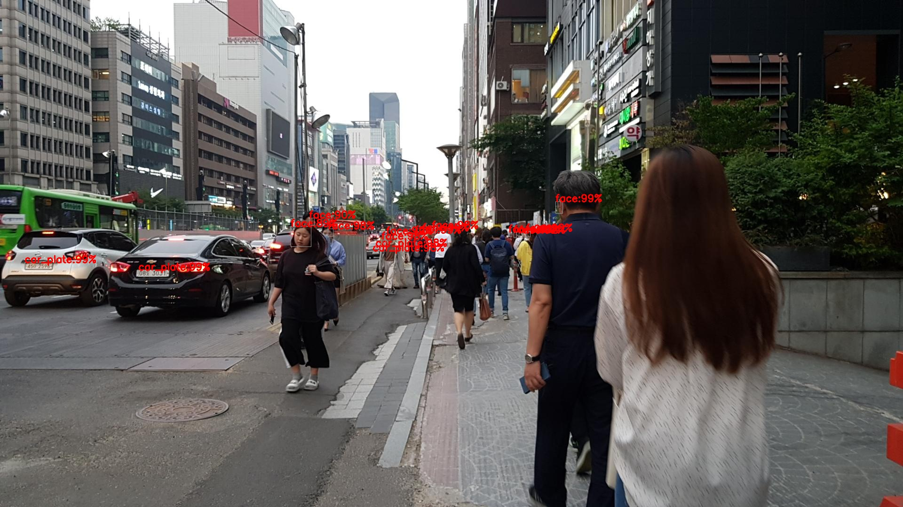
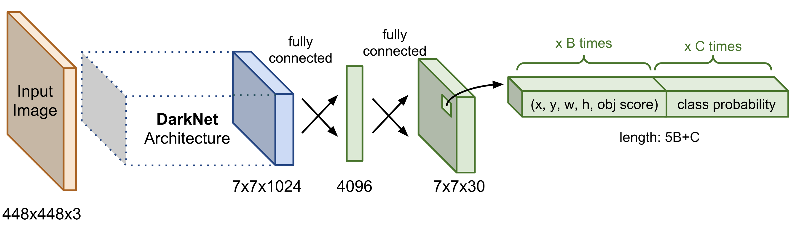
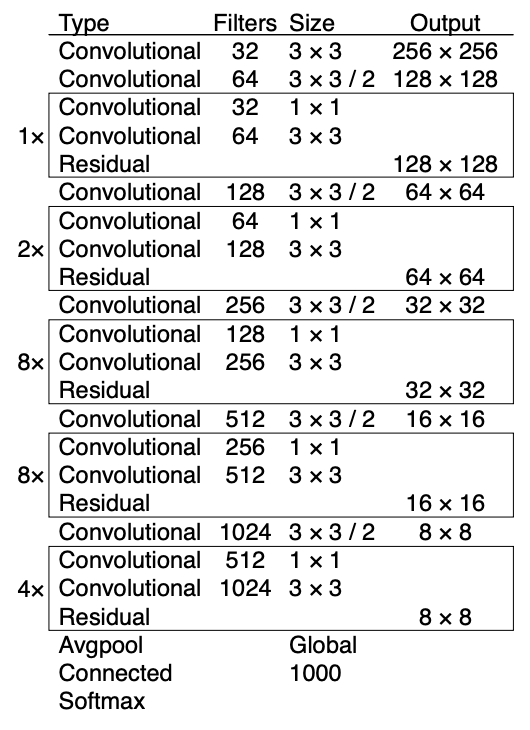
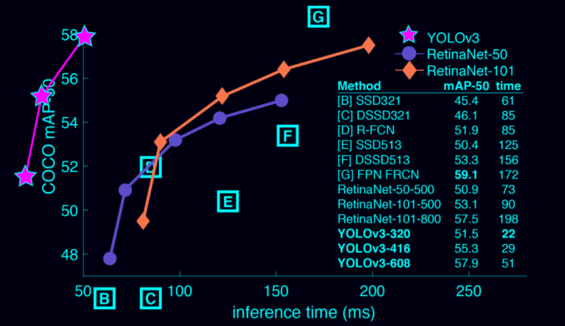

# AI Face / License Plate Detection 
## Introduction
Statistical machine learning models in general are very dependent on datasets. The more diverse information the model can train, the more robust model you would get. This project provides a robust detection model using Yolo v3 which was trained with real-life face and license plate photos taken in South Korea.

### Demo Results
#### Input Image
Note: Bounding boxes are filled because of security reasons.
<p align="center">
  
</p>

#### Inferred Image
<p align="center">
  
</p>

## 1. Model Overview 
### What is YOLO v3 ?
<p align="center">
  
</p>
<p align="center">
  
</p>
Yolo v3 is a very light and relatively accurate real-time object detection algorithm. It is a unified model which does not have region proposal stage thus able to detect objects faster. Also, this architecture predicts based on the whole image which benifits in encoding contextual information.

#### Performance of YOLO v3
<p align="center">
  
</p>

### Advantages of re-training YOLO v3
[Existing Pre-trained Models](https://github.com/yeephycho/tensorflow-face-detection) are not able to successfully detect small objects. With collecting and training real-life face and license plate images of South Korea, our newly trained YOLO v3 model is able to detect smaller objects.

## 2. Dataset Overview
We have collected real-life images containing face and license-plate in cities of South Korea. This dataset helped us provide our model more contextual information of cities in South Korea.

#### Classes Information
This information will be specified in ```classes.names``` file within dataset root folder. Keep in mind when making your own dataset.

Classes | Index
------------ | -------------
Face | 0
License Plate | 1

### Dataset File Format
- Image : JPEG Images in 1920 * 1080 resolution
- Label : Text file in following format
	```
	[label] [center_x] [center_y] [width] [height]
	[label] [center_x] [center_y] [width] [height]
	...
	```

### Statstics
<b>Train</b>

Categories | Info
------------ | -------------
Total Number of Images | 34363
Number of Face | 16950
Number of License Plate | 62748

<b>Validation</b>

Categories | Info
------------ | -------------
Total Number of Images | 5000
Number of Face | 2499
Number of License Plate | 8982


## 3. Usage
### 3.1 Setting Up the Environment
1. Download Anaconda python environment via the link on the right. [Anaconda Download Link](https://docs.anaconda.com/anaconda/install/windows/)
2. Download dependencies by typing in the following commands in your command line tool(CMD, Terminal ...) 
    
    2.1. CD in to the downloaded repository.
    ```bash
    cd [absolute_path_to_repository]
    ```
    
    2.2. Download packages by typing in following commands.
    ```bash
    conda install tensorflow==1.14
    ```
    ```bash
    conda install pytorch torchvision cpuonly -c pytorch
    ```
    ```bash
    conda install -c menpo opencv
    ```
    ```bash
    pip install opencv-contrib-python
    ```
    ```bash
    pip install --upgrade lxml
    ```
    ```bash
    conda install matplotlib
    ```

### 3.2 Inferencing    
1. Paste in the images that you want to infer in to the ```input``` folder in a format specified down below.
    ```
    Project Directory
        ├──input
        │   ├── folder_1
        │	│     ├── image_1.jpg
        │	│     ├── image_2.jpg
        │	│     ├── ...
        │   │
        │   ├── folder_2
        │   └── ...
    ```
2. Run the program by typing in following command.
    ```bash
    python main.py
    ```
3. Inferred results are goin to be saved in ```output``` folder.

### 3.3 Training with your own dataset
1. Make you own dataset directory in following format
    ```
    Dataset Directory
        ├──bbox dataset root
        │   ├── images
        │	│     ├── image_1.jpg
        │	│     ├── ...
        │   │
        │   ├── labels
        │	│     ├── image_1.jpg.txt
        │	│     ├── ...
    ```
2. Paste your dataset (images and corresponding labels) like the structure above. Format of the dataset can be referred above in dataset section.
3. Split dataset to Train/Validation and store information in a text file like the example below.
	train.txt
	```
	image_1.jpg, image_1.jpg.txt
	image_2.jpg, image_2.jpg.txt
	```
4. Change train settings by updating ```./detection_api/settings.py``` file.
5. Train
	```bash
	python train.py
	```

## 4. Performance
We have clearly shown the effectiveness of our re-trained model beating pre-trained Yolo-v3 by almost 5%. This has once again proven the importance of diverse dataset in order to train a robust prediction system.

Class | AP
------------ | -------------
Face | 38.43%
License Plate | 86.08%

Model | MAP
------------ | -------------
<b>Ours</b> | <b>62.25%</b>
Pretrained Yolo v3 | 57.9%
